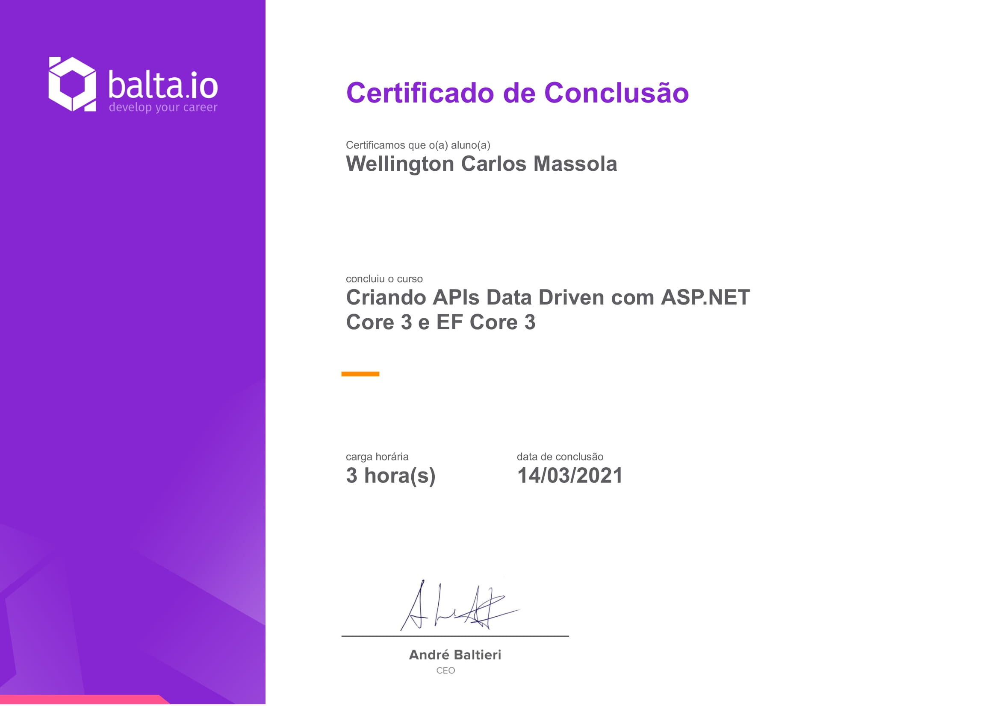

# Curso [balta.io 7194](https://balta.io/cursos/criando-apis-data-driven-com-aspnet-core-3-e-ef-core-3)

Curso Backend de Nível Básico para criação de APIs utilizando ASP.NET e C#. 

Link do curso: [https://balta.io/cursos/criando-apis-data-driven-com-aspnet-core-3-e-ef-core-3](https://balta.io/cursos/criando-apis-data-driven-com-aspnet-core-3-e-ef-core-3)

Tecnologias:  
 

## Criando API Data Driven com ASP.NET Core 3 e EF Core 3

Criar uma API voltada para CRUD de forma simples e rápida.

## Instrutor

André Baltieri - 8x Microsoft MVP

## Progresso do curso (3.5 horas)

- [x] Apresentação (1 min)
- [x] Instalação (12 min)
- [x] Estrutura da API (11 min)
- [x] Data Driven (3 min)
- [x] Category Model (5 min)
- [x] Product Model (4 min)
- [x] User Model (1 min)
- [x] Rotas (7 min)
- [x] Rotas - REST (4 min)
- [x] Parâmetros via URL (3 min)
- [x] Capturando JSON enviado (8 min)
- [x] PUT e DELETE (3 min)
- [x] Task e Action Results (7 min)
- [x] Validando o Modelo (4 min)
- [x] Data Context (5 min)
- [x] Dependency Injection (7 min)
- [x] Criando uma Categoria (3 min)
- [x] Manipulando Erros (2 min)
- [x] Atualizando uma Categoria (4 min)
- [x] Excluindo uma Categoria (3 min)
- [x] Get e GetById (5 min)
- [x] Iniciando Controller de Produtos (4 min)
- [x] Lendo os Produtos (3 min)
- [x] Finalizando Controller de Produtos
- [x] EF Core e SQL Server (5 min)
- [x] Conectando ao SQL Server (8 min)
- [x] Autenticação e Autorização (7 min)
- [x] Gerando o Token (5 min)
- [x] Autenticando (7 min)
- [x] Autorizando (4 min)
- [x] Segurança nos Controllers (3 min)
- [x] Versionamento, Cache e Compressão (5 min)
- [x] Documentando a API (5 min)
- [x] IMPORTANTE: Ajustes na API (6 min)
- [x] Iniciando com Microsoft Azure (5 min)
- [x] Resource Groups (3 min)
- [x] WebApp (6 min)
- [x] SQL Server (3 min)
- [x] Escalonamento Automático (5 min)
- [x] Connection String (4 min)
- [x] Enviando o Código para o GitHub (6 min)
- [x] Publicando a API (3 min)
- [x] Conectando ao SQL Server (7 min)
- [x] Finalização (1 min)

